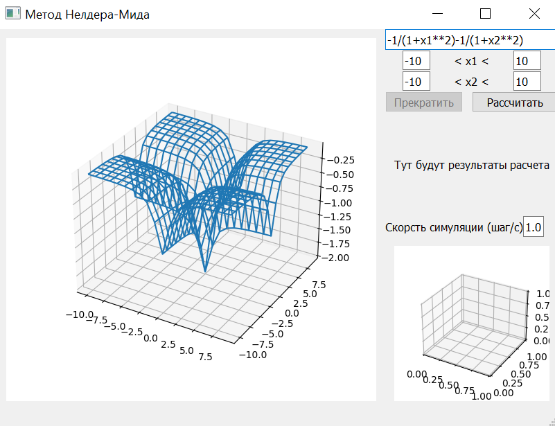
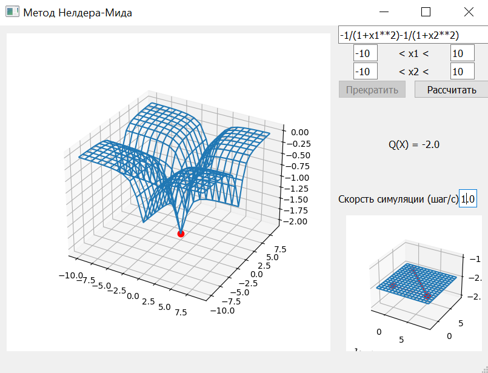

# Метод Нелдера-Мида

## Установка

1. Установить [Python 3.12](https://www.python.org/downloads/).
2. Клонировать репозиторий: `git clone https://github.com/DanilVolkov/lab-for-MO.git`
3. Настроить виртуальное окружение (подробнее см. [здесь](https://teletype.in/@kurilkv/CodimGitHub#R7Xn) в разделе *ADVANCED LVL*)
4. Установить зависимости: `pip install -r requirements.txt`
5. Точки входа: app.py для запуска через UI интерфейс или main.py для запуска консольного приложения.

---

## Введение

Метод Нелдера - Мида, также известный как метод деформируемого многогранника и симплекс-метод, - метод безусловной оптимизации функции от нескольких переменных, не использующий производной градиентов функции.

Метод Нелдера - Мида был разработан в 1965 году Джоном Нелдером и Роджером Мидом. Они искали метод оптимизации, который мог бы работать с функциями, не имеющими производных или не имеющими аналитических формул для производных. Они также хотели разработать метод, который был бы прост в реализации и эффективен для использования на вычислительных машинах того времени. Исследования привели их к идее использования симплекса - многогранника в пространстве параметров функции.

Симплекс представляет собой набор точек, образующих многогранник, где каждая точка – это набор значений параметров оптимизируемой функции. Идея заключается в том, чтобы изменять и перемещать симплекс в пространстве параметров, чтобы найти оптимальное значение функции.

---

## Цель работы

Изучить метод Нелдера-Мида, научиться применять его на практике посредством реализации на языке программирования Python.

---

## Теоретический материал

Метод Нелдера – Мида применяется для нахождения решения задачи оптимизации вещественных функций многих переменных

$$f(x) -> min, \forall x \in R^n$$

причем функция f(x) не является гладкой.

Другой особенностью метода является то, что на каждой итерации вычисляется значение функции f(x) не более чем в трех точках. Это особенно важно в случае сложно-вычислимой функции f(x). Метод Нелдера - Мида прост в реализации и полезен на практике, так как не подразумевает поиск решения через производные. Но, с другой стороны, для него <u>не существует теории сходимости*</u> - алгоритм может расходиться даже на гладких функциях.

Симплексом (n-симплексом) называется выпуклая оболочка множества** независимых (n + 1) точек (вершин симплекса).

> *Функция f(x) сходится к предельному значению L при x→a, если для любого положительного числа $$\epsilon$$ существует положительное число $$\gamma$$, такое что для всех x удовлетворяющих условиям 0\<\|x−a\|\<$$\gamma$$, выполнено неравенство \|f(x)−L\|\<$$\epsilon$$.

> **Выпуклая оболочка множества - это наименьшее выпуклое множество, которое его содержит. Им будет пересечение всех выпуклых множеств, содержащих множество.

---

## Описание алгоритма

Алгоритм метода Нелдера – Мида включает следующие шаги:

 1. <u>Инициализация:</u> строится симплекс - многогранник в n-мерном пространстве, где n - количество переменных функции оптимизации;

 2. <u>Оценка значений функции:</u> вычисляются значения функции в вершинах симплекса;

 3. <u>Сортировка:</u> вершины сортируются в порядке убывания значений функции;

 4. <u>Центр тяжести:</u> вычисляется центр тяжести симплекса без наихудшей вершины;

 5. <u>Отражение:</u> проводится отражение на основе центра тяжести и лучшей вершины симплекса;

 6. <u>Оценка нового значения функции в отраженной точке;</u>

 7. <u>Расширение:</u> если новая точка лучше, чем лучшая вершина симплекса, происходит расширение в этом направлении;

 8. <u>Сжатие:</u> если новая точка хуже, чем наихудшая вершина, происходит сжатие симплекса в сторону лучшей вершины;

 9. <u>Метод средней точки:</u> если ни одно из вышеупомянутых действий не улучшает значение функции, то сжимаем симплекс в сторону центра тяжести без наихудшей вершины;

10. <u>Условие останова:</u> алгоритм завершается, если выполнено условие сходимости, например, при достижении заданной точности или после определенного числа итераций.

Алгоритм метода Нелдера – Мида повторяется до достижения оптимального значения функции или условия останова.

---

## Идентификация функций, проходящих через метод

Основная идея метода заключается в том, что он использует только значения функции в различных точках пространства параметров, чтобы определить, в каком направлении двигаться к минимуму.

Рассмотрим функции, которые проходят тесты.

1. Функция Химмельблау — функция двух переменных, используемая для проверки эффективности алгоритмов оптимизации.

Она определяется формулой:

$$(x_0^2 + x_1 -11)^2 + (x_0 + x_1^2 - 7)^2$$

Функция Химмельбау содержит четыре равнозначных локальных минимума:

$$f(3, 2)=0;$$

$$f(-2,80511…, 3,13131…)=0;$$

$$f(-3,77931…, -3,28318…)=0;$$

$$f(3,58442…, -1,84812…)=0.$$

Создается лямбда-функция f, которая вычисляет значение функции в точке.

Функция calculate_neldermead вызывается для поиска минимума функции Химмельблау в двумерном пространстве. Полученные координаты точки значение функции сохраняются. Ожидаемая точка минимума равна [3, 2], а ожидаемое значение функции в этой точке равно 0. Тест проверяет, что полученная точка близка к ожидаемой и что значение функции близко к нулю. Но мы проверяем приблизительные значения с точностью до пяти знаков после запятой.

2. Функция Розенброка

Невыпуклая функция, используемая для оценки производительности алгоритмов оптимизации, предложенная Ховардом Розенброком в 1960 году. Считается, что поиск глобального минимума для данной функции является нетривиальной задачей. Является примером тестовой функции для локальных методов оптимизации. Имеет минимум 0 в точке (1,1).

Функция определена следующим образом:

$$(1 - x_0)^2 + 100(x_1 - x_0^2)^2$$

И также мы проверили простую квадратичную функцию:

$$(x_0 - 1)^2 $$

Сначала в тесте определяется функция. Затем создается лямбда-функция, которая вычисляет значение функции в точке x. Функция calculate_neldermead вызывается для поиска минимума этой функции в одномерном пространстве. Полученные координаты точки и значение функции сохраняются. Ожидаемая точка минимума равна 1, а ожидаемое значение функции в этой точке равно 0. Тест проверяет, что полученная точка близка к ожидаемой и что значение функции близко к нулю с помощью методов assert_array_almost_equal и assertAlmostEqual из библиотеки NumPy.

Функции, которые не подходят под метод:

При написании математических тестов стало ясно, что не все функции идеально подходят для его применения. Для повышения эффективности и увеличения шансов на точное нахождение минимума, нужно обратиться к различным алгоритмам. Например, в таких случаях часто применяют метод Монте-Карло или эволюционно-генетический алгоритм. Эти методы позволяют дополнительно оптимизировать процесс поиска минимума и обеспечивают более надежные результаты. Комбинирование различных подходов подтверждает значимость и многообразие методов оптимизации, их применение становится ключевым фактором в достижении желаемых результатов в решении сложных задач оптимизации. Пример такой функции – **<u>функция Растригина.</u>**

1. Функция Растригина

Нахождение минимума этой функции является достаточно трудной задачей из-за большой области поиска и большого количества локальных минимумов. Метод Нелдера-Мида является простым и эффективным методом оптимизации для невыпуклых функций без ограничений, но он не подходит для задач оптимизации со многими локальными минимумами. В таких случаях метод Нелдера-Мида может застрять и не дойти до глобального минимума. Тест проверяет работу метода Нелдера-Мида для функции Растригина. Вначале определяется функция Растригина, которая имеет формулу

$$20 + (x_0 - 5)^2 + (x_1 - 5)^2 - 10cos(2 \pi x_0) - 10cos(2 \pi x_1)$$

Затем создается лямбда-функция, которая вычисляет значение функции в точке. Далее вызывается функция по нахождению минимум функции Растригина в двумерном пространстве. Полученные координаты точки и значение функции сохраняются. Ожидаемая точка минимума равна \[5, 5\], а ожидаемое значение функции в этой точке равно 0. Тест проверяет, что полученная точка близка к ожидаемой и что значение функции близко к нулю с помощью методов из библиотеки NumPy. Если тест не проходит, он выводит сообщение об ошибке.

---

## Вывод

Метод Нелдера-Мида является эффективным инструментом для оптимизации функций без использования градиента. Его простота и эффективность делают его популярным выбором для различных задач оптимизации. Но данный метод не подходит для задач оптимизации со многими локальными минимумами.

---

## Примеры выполнения программы

1. Запуск файла app.py
   
2. Нажимаем кнопку "Рассчитать"
   
3. Результат
   

---

## Источники

1. [https://ru.wikipedia.org/wiki/Метод_Нелдера_—_Мида](https://ru.wikipedia.org/wiki/%D0%9C%D0%B5%D1%82%D0%BE%D0%B4_%D0%9D%D0%B5%D0%BB%D0%B4%D0%B5%D1%80%D0%B0_%E2%80%94_%D0%9C%D0%B8%D0%B4%D0%B0)

2. [https://www.mql5.com/ru/articles/13805](https://www.mql5.com/ru/articles/13805)

3. [https://mathprofi.com/uploads/files/1156_f_41_metody-optimizacii-negladkih-funkcii.pdf?key=a94b32268f6014b85c9c48ef842cc5db/](https://mathprofi.com/uploads/files/1156_f_41_metody-optimizacii-negladkih-funkcii.pdf?key=a94b32268f6014b85c9c48ef842cc5db/)

4. [https://ru.wikipedia.org/wiki/Функция_Растригина](https://vk.com/away.php?to=https%3A%2F%2Fru.wikipedia.org%2Fwiki%2F%D4%F3%ED%EA%F6%E8%FF_%D0%E0%F1%F2%F0%E8%E3%E8%ED%E0&cc_key=)

5. [https://ru.wikipedia.org/wiki/Функция_Химмельблау](https://ru.wikipedia.org/wiki/%D0%A4%D1%83%D0%BD%D0%BA%D1%86%D0%B8%D1%8F_%D0%A5%D0%B8%D0%BC%D0%BC%D0%B5%D0%BB%D1%8C%D0%B1%D0%BB%D0%B0%D1%83)

6. [https://ru.wikipedia.org/wiki/Функция_Розенброка](https://ru.wikipedia.org/wiki/%D0%A4%D1%83%D0%BD%D0%BA%D1%86%D0%B8%D1%8F_%D0%A0%D0%BE%D0%B7%D0%B5%D0%BD%D0%B1%D1%80%D0%BE%D0%BA%D0%B0)

---

## Авторы

1. [Волков Д.А](https://github.com/DanilVolkov)

2. [Бузникова М.О.](https://github.com/MariaBuznikova)

3. [Стаценко А.П.](https://github.com/StatsenkoArs)

4. [Трошанин Ф.И.](https://github.com/ActiWait)

5. [Гурьянов И.А.](https://github.com/ProWega)